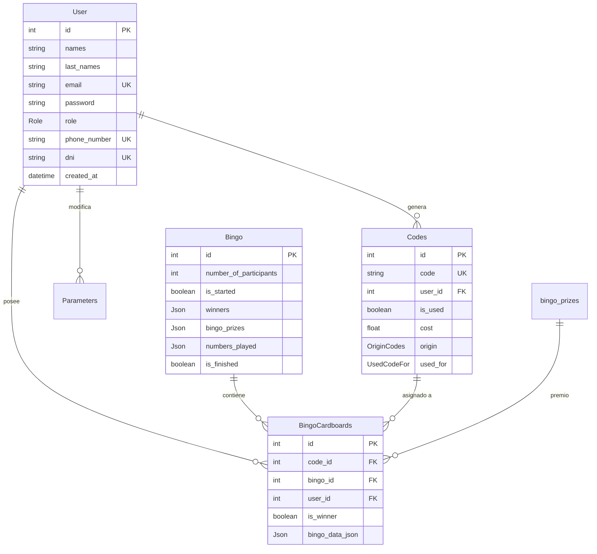

# 🗄️ Esquema de Base de Datos

## Índice
1. [Diagrama de Relaciones](#diagrama-de-relaciones)
2. [Modelos](#modelos)
3. [Enumeraciones](#enumeraciones)
4. [Campos JSON](#campos-json)
5. [Relaciones](#relaciones)

---

## Diagrama de Relaciones



---

## Modelos

### 1. **User** (Usuarios)

Almacena información de los jugadores y administradores.

```prisma
model User {
  id                 Int       @id @default(autoincrement())
  names              String
  last_names         String
  email              String    @unique
  password           String
  role               Role      @default(USER)
  phone_number       String?   @unique
  account_owner_name String?
  account_owner_dni  String?
  account_number     String?
  bank_name          String?
  dni                String?   @unique
  created_at         DateTime  @default(now())
  updated_at         DateTime  @updatedAt
  deleted_at         DateTime?
  code_verification  String?
  change_password    Boolean?  @default(false)
  is_verified        Boolean?  @default(false)
}
```

**Campos Clave:**
- `role`: Tipo de usuario (`ADMIN`, `USER`, `OPERADOR`)
- `account_*`: Información bancaria para transferencias de premios
- `is_verified`: Si el correo fue verificado
- `deleted_at`: Soft delete (eliminación lógica)

---

### 2. **Bingo** (Juegos de Bingo)

Representa una sala/juego de bingo.

```prisma
model Bingo {
  id                         Int       @id @default(autoincrement())
  number_of_participants     Int       @default(0)
  cardboard_by_code          Int
  is_started                 Boolean   @default(false)
  min_number_of_participants Int?
  is_finished                Boolean?  @default(false)
  start_time                 String?   // Hora de inicio en formato HH:mm (hora militar)
  winners                    Json?     // Ver estructura abajo
  bingo_prizes               Json?     // Ver estructura abajo
  numbers_played             Json?     // Ver estructura abajo
  created_at                 DateTime  @default(now())
  updated_at                 DateTime  @updatedAt
  deleted_at                 DateTime?
}
```

**Campos Clave:**
- `is_started`: Si el bingo está en curso
- `is_finished`: Si el bingo finalizó (normalmente o por expiración)
- `start_time`: Hora programada de inicio (formato HH:mm, hora Venezuela)
- `winners`: Array JSON de ganadores
- `bingo_prizes`: Configuración de premios
- `numbers_played`: Historial de números sorteados

**Nota sobre Transferencia de Cartones:**
- Cuando un bingo expira sin iniciarse (no alcanza mínimo de participantes), los cartones no jugados se transfieren automáticamente al siguiente bingo
- Un cartón se considera "no jugado" si `is_winner = false` y no tiene números marcados (negativos) en `bingo_data_json`

---

### 3. **BingoCardboards** (Cartones)

Representa un cartón de bingo asignado a un usuario.

```prisma
model BingoCardboards {
  id              Int       @id @default(autoincrement())
  code_id         Int       // FK a Codes
  bingo_id        Int       // FK a Bingo
  user_id         Int       // FK a User
  is_winner       Boolean   @default(false)
  bingo_data_json Json      // Ver estructura abajo
  prize_id        Int?      // FK a bingo_prizes
  created_at      DateTime  @default(now())
  updated_at      DateTime  @updatedAt
  deleted_at      DateTime?
}
```

**Campos Clave:**
- `is_winner`: Si este cartón ya ganó (evita reclamaciones duplicadas)
- `bingo_data_json`: Estructura del cartón (5x5 con números)

---

### 4. **Codes** (Códigos de Participación)

Códigos que los usuarios canjean para obtener cartones.

```prisma
model Codes {
  id         Int          @id @default(autoincrement())
  code       String       @unique
  origin     OriginCodes  @default(DISPONIBLE)
  used_for   UsedCodeFor  @default(DISPONIBLE)
  user_id    Int
  is_used    Boolean      @default(false)
  cost       Float?       @default(1.0)
  used_date  DateTime?
  created_at DateTime     @default(now())
  updated_at DateTime     @updatedAt
  deleted_at DateTime?
}
```

**Campos Clave:**
- `origin`: De dónde viene el código (`PRODUCTO_PROMOCIONAL`, `CUPON`)
- `used_for`: Para qué se usa (`BINGO`, `SORTEO`)
- `is_used`: Si ya fue canjeado

---

### 5. **Parameters** (Parámetros del Sistema)

Configuración global del sistema.

```prisma
model Parameters {
  id                         Int       @id @default(autoincrement())
  cost_per_code              Float     @default(1.0)
  min_participants_for_bingo Int       @default(2)
  cardboard_per_code         Int       @default(2)
  bingo_prizes               Json?
  start_time                 String?   // Hora de inicio en formato HH:mm (hora militar)
  last_modified_by_id        Int?
  created_at                 DateTime  @default(now())
  updated_at                 DateTime  @updatedAt
  deleted_at                 DateTime?
}
```

**Campos Clave:**
- `start_time`: Hora de inicio del bingo en formato `HH:mm` (hora militar, zona Venezuela)
  - Ejemplo: `"08:00"` = 8:00 AM
  - Ejemplo: `"14:00"` = 2:00 PM
  - Si es `null`, se usa `BINGO_START_TIME` de variables de entorno
  - El sistema siempre usa el último registro de `parameters` (ordenado por `id DESC`)

---

### 6. **bingo_prizes** (Catálogo de Premios)

Tabla de premios disponibles.

```prisma
model bingo_prizes {
  id          Int       @id @default(autoincrement())
  prize       String?
  description String?
  prize_image String?
  quantity    Int?
  status      status?   @default(ACTIVO)
  created_at  DateTime  @default(now())
}
```

---

## Enumeraciones

### `Role` (Roles de Usuario)
```prisma
enum Role {
  ADMIN      // Administrador del sistema
  USER       // Jugador regular
  OPERADOR   // Operador de sesiones
}
```

### `bingo_victories` (Tipos de Victoria)
```prisma
enum bingo_victories {
  CARTON_LLENO     // Cartón completo
  LINEA_SIMPLE     // 1 línea
  LINEA_DOBLE      // 2 líneas
  CUATRO_ESQUINAS  // 4 esquinas
  PERIMETRO        // Perímetro del cartón
  LETRA_H          // Forma de H
  NUMERO_7         // Forma de 7
  FLECHA           // Forma de flecha
}
```

### `OriginCodes` (Origen de Códigos)
```prisma
enum OriginCodes {
  PRODUCTO_PROMOCIONAL  // Código de producto
  CUPON                 // Cupón promocional
  DISPONIBLE            // Sin usar
}
```

### `UsedCodeFor` (Uso de Código)
```prisma
enum UsedCodeFor {
  BINGO       // Para jugar bingo
  SORTEO      // Para sorteos
  DISPONIBLE  // Sin asignar
}
```

### `status` (Estado de Premio)
```prisma
enum status {
  ACTIVO    // Premio disponible
  INACTIVO  // Premio no disponible
}
```

---

## Campos JSON

### `Bingo.winners`

Almacena el array de ganadores. **IMPORTANTE**: Este campo siempre debe tener la estructura `{ data: WinnerDTO[] }`, nunca debe ser `null` o tener una estructura diferente.

**Estructura:**
```typescript
{
  data: WinnerDTO[]
}
```

**Normalización:**
- El sistema usa la función `normalizeWinners()` para garantizar que siempre tenga esta estructura
- Si el campo viene como `null` o tiene estructura incorrecta desde la BD, se normaliza automáticamente
- Al crear un bingo, siempre se inicializa como `{ data: [] }`

**Tipo `WinnerDTO`:**
```typescript
{
  user_id: number;
  user_email: string;
  user_names: string;
  user_last_names: string;
  user_phone_number?: string;
  user_account_owner_dni?: string;
  user_account_number?: string;
  user_bank_name?: string;
  user_dni?: string;
  prize_id: number;
  prize_name: string;
  prize_description?: string;
  prize_image?: string;
  type_of_victory: VictoryType;
}
```

**Ejemplo cuando hay ganadores:**
```json
{
  "data": [
    {
      "user_id": 123,
      "user_email": "juan@example.com",
      "user_names": "Juan",
      "user_last_names": "Pérez",
      "prize_id": 1,
      "prize_name": "Premio Mayor",
      "type_of_victory": "CARTON_LLENO"
    }
  ]
}
```

**Ejemplo cuando no hay ganadores (inicial):**
```json
{
  "data": []
}
```

**⚠️ IMPORTANTE:**
- El campo `winners` **NUNCA** debe ser `null` en la base de datos
- Siempre debe tener la estructura `{ data: [] }` o `{ data: [...] }`
- El sistema usa la función `normalizeWinners()` para garantizar esta estructura
- Si el campo viene como `null` desde la BD, se normaliza automáticamente a `{ data: [] }`

---

### `Bingo.bingo_prizes`

Configuración de premios para este bingo.

**Estructura:**
```typescript
{
  prizes: Prize[]
}
```

**Tipo `Prize`:**
```typescript
{
  prize_id: number;
  name: string;
  description?: string;
  image?: string;
  type_of_victory: VictoryType;
}
```

**Ejemplo:**
```json
{
  "prizes": [
    {
      "prize_id": 1,
      "name": "Premio Mayor",
      "description": "Cartón completo",
      "type_of_victory": "CARTON_LLENO"
    },
    {
      "prize_id": 2,
      "name": "Premio Línea",
      "type_of_victory": "LINEA_SIMPLE"
    }
  ]
}
```

---

### `Bingo.numbers_played`

Historial de números sorteados.

**Estructura:**
```typescript
{
  sequence: number[];  // Todos los números en orden
  last5: number[];     // Últimos 5 (para UI)
}
```

**Ejemplo:**
```json
{
  "sequence": [12, 45, 67, 23, 89, 34, 56, 78],
  "last5": [23, 89, 34, 56, 78]
}
```

---

### `BingoCardboards.bingo_data_json`

Estructura del cartón (matriz 5x5).

**Estructura:**
```typescript
{
  size: number;           // Siempre 5
  columns: Column[];      // 5 columnas
}

type Column = {
  numbers: number[];      // 5 números por columna
}
```

**Convención de Números Marcados:**
- **Positivo**: Número sin marcar (ej: `23`)
- **Negativo**: Número marcado (ej: `-23`)
- **0**: Casilla FREE (siempre marcada)

**Ejemplo:**
```json
{
  "size": 5,
  "columns": [
    { "numbers": [12, -23, 34, 0, 56] },
    { "numbers": [17, 28, -39, 40, 51] },
    { "numbers": [-13, 24, 0, 46, 57] },
    { "numbers": [18, 29, 30, -41, 52] },
    { "numbers": [19, -20, 31, 42, 53] }
  ]
}
```

**Interpretación:**
- `23`, `39`, `13`, `41`, `20` están **marcados** (negativos)
- Posición `[0][3]` y `[2][2]` son **FREE** (valor 0)

---

## Relaciones

### 1. **User → BingoCardboards**

Un usuario puede tener **múltiples cartones**.

```prisma
User.BingoCardboards → BingoCardboards[]
```

### 2. **Bingo → BingoCardboards**

Un bingo tiene **múltiples cartones**.

```prisma
Bingo.BingoCardboards → BingoCardboards[]
```

### 3. **Codes → BingoCardboards**

Un código puede generar **múltiples cartones**.

```prisma
Codes.BingoCardboards → BingoCardboards[]
```

### 4. **User → Codes**

Un usuario genera **múltiples códigos**.

```prisma
User.Codes → Codes[]
```

### 5. **BingoCardboards → bingo_prizes**

Un cartón puede estar asociado a un **premio** (opcional).

```prisma
BingoCardboards.bingo_prizes → bingo_prizes?
```

---

## Consultas Comunes

### Obtener cartones de un usuario en un bingo

```typescript
const boards = await prisma.bingoCardboards.findMany({
  where: {
    user_id: userId,
    bingo_id: bingoId
  },
  include: {
    user: true,
    bingo: true
  }
});
```

### Obtener ganadores de un bingo

```typescript
const bingo = await prisma.bingo.findUnique({
  where: { id: bingoId }
});

const winners = (bingo.winners as any)?.data ?? [];
console.log(winners); // Array de WinnerDTO
```

### Marcar cartón como ganador

```typescript
await prisma.bingoCardboards.update({
  where: { id: boardId },
  data: { is_winner: true }
});
```

---

## 🔗 Documentos Relacionados

- [Arquitectura del Sistema](./ARCHITECTURE.md)
- [Patrones de Victoria](./VICTORY_PATTERNS.md)
- [Eventos de Socket.IO](./SOCKET_EVENTS.md)
