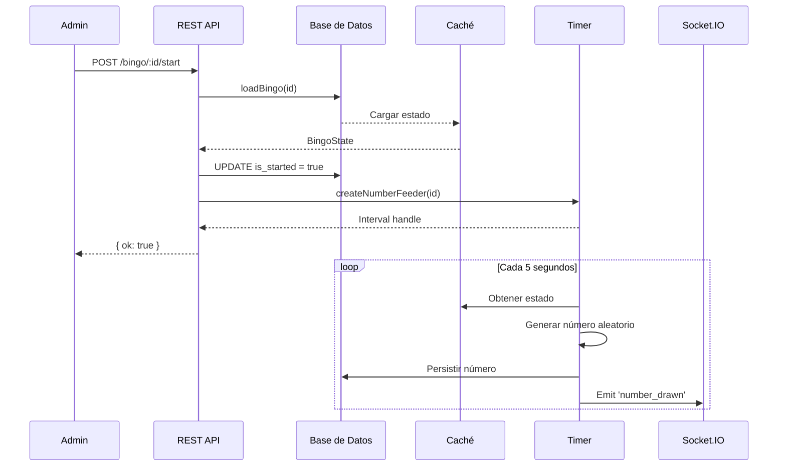
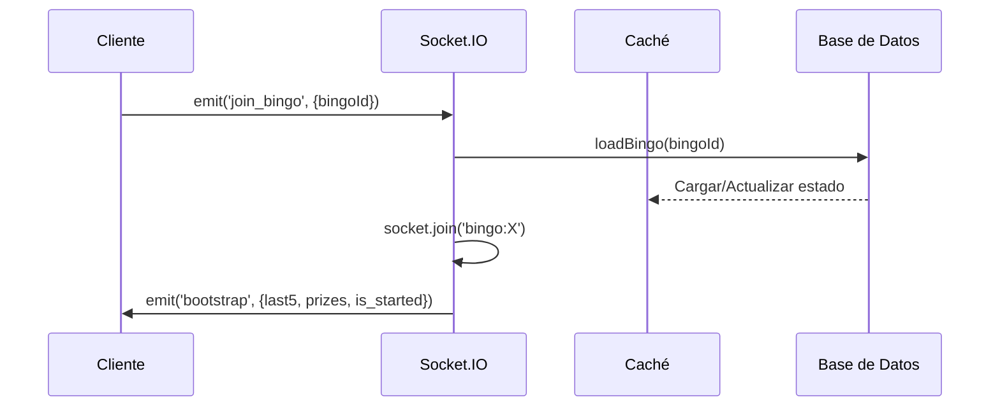
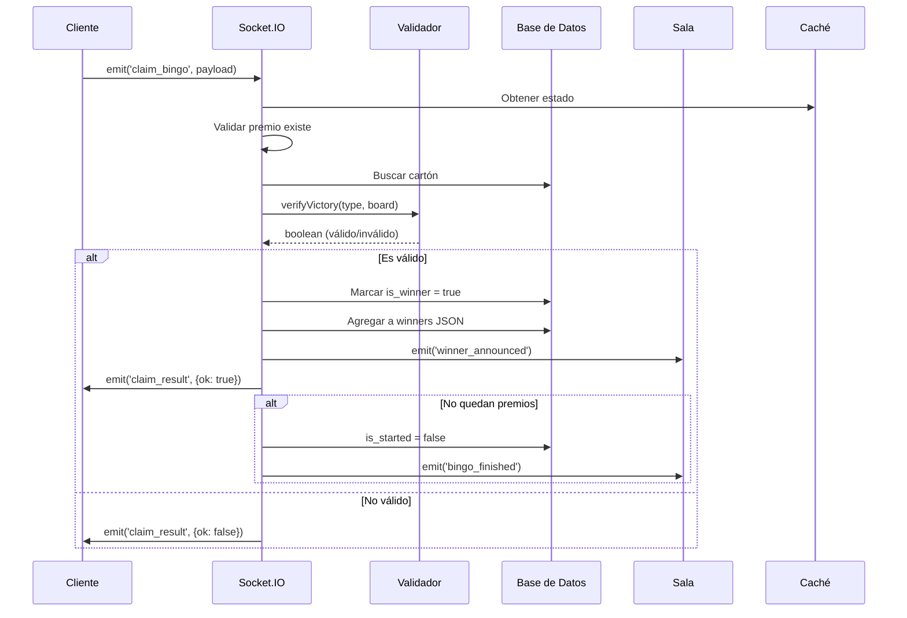

# 🏗️ Arquitectura del Sistema de Bingo

## Índice
1. [Visión General](#visión-general)
2. [Componentes del Sistema](#componentes-del-sistema)
3. [Flujo de Datos Detallado](#flujo-de-datos-detallado)
4. [Sistema de Caché](#sistema-de-caché)
5. [Gestión de Salas](#gestión-de-salas)
6. [Ciclo de Vida de un Bingo](#ciclo-de-vida-de-un-bingo)

---

## Visión General

El sistema está diseñado con una arquitectura **híbrida REST + WebSocket**, donde:

- **REST API**: Control administrativo (iniciar/detener bingo, consultar estado)
- **WebSocket (Socket.IO)**: Eventos en tiempo real (números sorteados, ganadores, bootstrapping)

### Principios de Diseño

1. **Baja Latencia**: Caché en memoria para estado activo de bingos
2. **Persistencia**: Todas las operaciones críticas se persisten en PostgreSQL
3. **Escalabilidad**: Uso de salas de Socket.IO para broadcast eficiente
4. **Validación Server-Side**: Toda lógica de victoria se valida en el servidor

---

## Componentes del Sistema

### 1. **Servidor HTTP y WebSocket**

```typescript
const app = express();
const server = http.createServer(app);
const io = new Server(server, { cors: { origin: "*" } });
```

- **Express**: Maneja endpoints REST
- **http.Server**: Servidor HTTP nativo de Node.js
- **Socket.IO**: Capa WebSocket sobre HTTP

### 2. **Cliente Prisma**

```typescript
const prisma = new PrismaClient();
```

- ORM para PostgreSQL
- Maneja modelos: `Bingo`, `BingoCardboards`, `User`, `Codes`, `Parameters`

### 3. **Caché de Estado (`activeBingos`)**

```typescript
const activeBingos = new Map<number, BingoState>();
```

**Estructura de `BingoState`:**
```typescript
type BingoState = {
  id: number;
  is_started: boolean;
  prizes: Prize[];              // Lista de premios configurados
  numbersPlayed: NumbersPlayed; // Historial de números
}
```

### 4. **Sistema de Sorteo Automático**

```typescript
function createNumberFeeder(bingoId: number): NodeJS.Timer
```

- Intervalo de **5 segundos** entre números
- Genera números del **1 al 75** sin repetición
- Se detiene cuando se agotan números o el bingo se detiene

---

## Flujo de Datos Detallado

### Diagrama de Flujo: Inicio de Bingo



### Diagrama de Flujo: Jugador se Une



### Diagrama de Flujo: Reclamación de Premio



---

## Sistema de Caché

### ¿Por Qué Caché en Memoria?

1. **Latencia**: Leer de base de datos en cada evento sería muy lento
2. **Frecuencia**: Los números se sortean cada 5 segundos
3. **Consistencia**: La caché se actualiza sincrónicamente con DB

### Operaciones de Caché

```typescript
// Cargar desde DB a caché
async function loadBingo(bingoId: number) {
  const b = await prisma.bingo.findUnique({/*...*/});
  const state: BingoState = { /* mapeo */ };
  activeBingos.set(bingoId, state); // ✅ Guardar en caché
}

// Actualizar caché y DB
async function pushNumber(bingoId: number, n: number) {
  const state = activeBingos.get(bingoId); // ✅ Leer de caché
  state.numbersPlayed.sequence.push(n);    // ✅ Modificar caché
  
  await prisma.bingo.update({              // ✅ Persistir
    where: { id: bingoId },
    data: { numbers_played: state.numbersPlayed }
  });
  
  io.to(roomName(bingoId)).emit(/*...*/); // ✅ Broadcast
}
```

---

## Gestión de Salas

### Concepto de Salas en Socket.IO

Cada bingo tiene una **sala identificada por su ID**:

```typescript
function roomName(bingoId: number) {
  return `bingo:${bingoId}`;
}
```

Ejemplo: `bingo:123`

### Operaciones de Sala

```typescript
// Cliente se une a sala
socket.join(roomName(bingoId));

// Broadcast a toda la sala
io.to(roomName(bingoId)).emit('number_drawn', data);

// Broadcast a TODOS los sockets
io.emit('global_announcement', data);
```

### Ventajas

- **Aislamiento**: Cada bingo tiene sus propios eventos
- **Eficiencia**: No se envían eventos a sockets que no están interesados
- **Escalabilidad**: Socket.IO optimiza internamente

---

## Ciclo de Vida de un Bingo

```
┌─────────────┐
│   CREADO    │ (is_started: false)
│             │
└──────┬──────┘
       │ POST /bingo/:id/start
       ▼
┌─────────────┐
│  INICIADO   │ (is_started: true)
│             │ Timer corriendo
└──────┬──────┘
       │ Jugadores reclaman premios
       ▼
┌─────────────┐
│ EN PROGRESO │ Algunos winners registrados
│             │
└──────┬──────┘
       │ (a) Todos los premios reclamados
       │ (b) POST /bingo/:id/stop (manual)
       │ (c) Se acaban los 75 números
       ▼
┌─────────────┐
│ FINALIZADO  │ (is_started: false)
│             │ Timer detenido
└─────────────┘
```

### Estados de Cartón

```
┌──────────────┐
│   ACTIVO     │ (is_winner: false)
│              │
└──────┬───────┘
       │ Reclama premio VÁLIDO
       ▼
┌──────────────┐
│   GANADOR    │ (is_winner: true)
│              │ ⚠️ No puede reclamar más
└──────────────┘
```

---

## Consideraciones de Concurrencia

### Problema: Múltiples Reclamos Simultáneos

Si 2 jugadores reclaman el mismo premio al mismo tiempo:

```typescript
// ⚠️ RIESGO: Race condition
const board = await prisma.bingo_cardboards.findUnique({...});
if (board.is_winner) return; // Puede fallar si ambos leen antes de escribir
```

### Solución: Transacción Atómica

```typescript
await prisma.$transaction([
  prisma.bingo.update({...}),
  prisma.bingo_cardboards.update({
    where: { id: boardId },
    data: { is_winner: true } // ✅ Atómico
  })
]);
```

### Validación Adicional

El servidor valida:
1. ✅ El cartón existe
2. ✅ El cartón NO es ganador (`is_winner: false`)
3. ✅ El patrón es válido
4. ✅ El premio existe y coincide con el tipo de victoria

---

## Escalabilidad Futura

### Limitaciones Actuales

- **Caché local**: No compartida entre instancias
- **Timer local**: No distribuido

### Mejoras Recomendadas

1. **Redis**: Caché compartida
2. **Bull/BullMQ**: Cola de trabajos para sorteo
3. **Adaptador Redis para Socket.IO**: Broadcast multi-instancia
4. **Load Balancer**: Nginx con sticky sessions

---

## 🔗 Documentos Relacionados

- [Eventos de Socket.IO](./SOCKET_EVENTS.md)
- [Esquema de Base de Datos](./DATABASE.md)
- [Endpoints REST](./API_ENDPOINTS.md)
